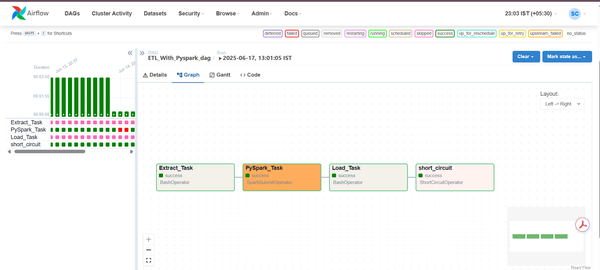

# ETL_PRJ_1 And ETL_PRJ_2

PySpark-based ETL project for automated data extraction, transformation, and loading. Includes Airflow DAGs, Bash, and Spark tasks to orchestrate workflows, enabling scalable, reliable processing and analytics for API-retrieved data.

## Features

- Automated ETL with PySpark
- Airflow DAG orchestration
- Bash and Spark integration

## Usage

1. Clone the repository.
2. Set up your Python environment and dependencies.
3. Configure Airflow and place the DAG in your Airflow `dags/` folder.
4. Trigger the DAG from the Airflow UI.

# Snippet of the Dag in Airflow Webserver UI

